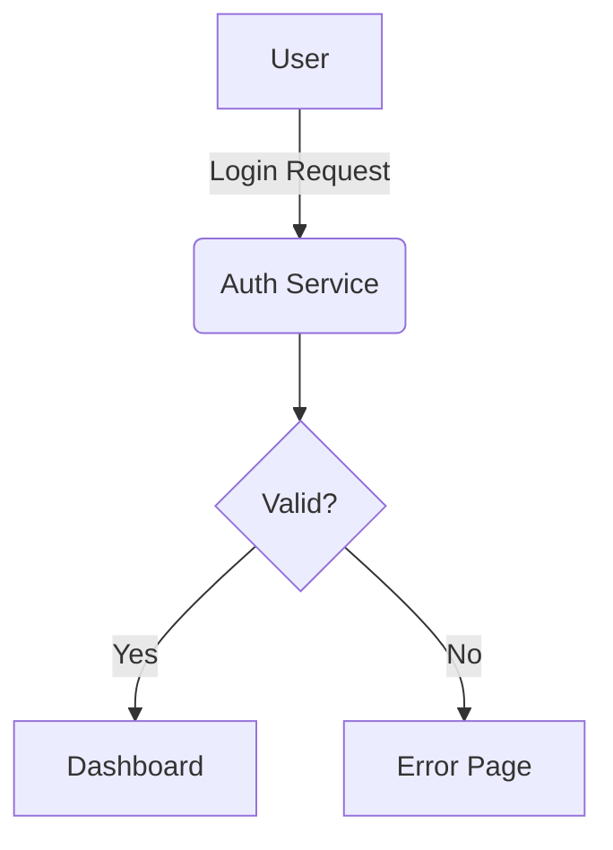

# 文本逻辑转绘图描述 Prompt 生成规约 (Text-to-Visual-Prompt Protocol)

## 1. 目标与核心逻辑
本规约旨在指导大语言模型（LLM）将输入的**文本描述**（如 Mermaid/Graphviz/PlatUML 代码、自然语言流程描述、算法步骤等）转化为一段结构化、高精度的**视觉化中文描述 (Chinese Visual Description)**。该结果将弥补纯文本缺乏视觉信息的短板，主动补充布局、配色和风格设定，作为提示词驱动支持中文的文生图模型绘制高质量图表。

**核心流程：**
`文本/代码` -> `[LLM 语义理解 + 视觉映射]` -> `结构化中文视觉描述` -> `[用户/绘图模型]`

---

## 2. 解析与映射维度 (Analysis & Visual Mapping)
LLM 在阅读文本时，需执行"翻译+导演"的双重任务，按以下顺序构建画面：

### 2.1 布局推断 (Layout Inference)
由于文本缺乏空间信息，LLM 需根据逻辑流向主动定义布局：
- **流向选择**：
  - 时间序列/步骤明确的流程 -> **从左到右（水平流）**或**S型布局**。
  - 层级结构/组织架构/分类 -> **从上到下（树状/垂直流）**。
  - 循环/闭环系统 -> **环形布局**。
- **模块划分**：分析文本中的逻辑段落，将相关步骤归类为"视觉容器"（如：虚线框包裹的子系统），并赋予背景色区分。

### 2.2 实体视觉化 (Entity Visualization)
将抽象名词映射为具体的视觉元素：
- **形状映射**：
  - **动作/处理** -> 矩形/圆角矩形。
  - **判断/决策** -> 菱形。
  - **数据/存储** -> 圆柱体。
  - **开始/结束** -> 胶囊形/圆形。
  - **角色/用户** -> 简笔画人物或特定图标（如机器人代表 AI）。
- **色彩策略**：主动为不同角色的节点分配色系（例如：用户端用蓝色系，服务端用绿色系，警告/错误用红色系）。

### 2.3 内容处理与中文化 (Content Processing)
对提取的文本内容进行**深度中文化**和**精简处理**：
- **强制翻译**：所有通用描述性词汇、动词、形容词（如 Start, Verify, User Input, Success 等）**必须**翻译为中文。
- **保留原则**：**仅**保留核心技术缩写（如 API, JSON, SQL, LLM）和专有名词（如 GitHub, AWS）。
- **精简文本**：图表中的文字应短小精悍，去除冗余的连词，将长句改为短语（例如："系统验证用户输入的密码是否正确" -> "验证密码"）。

### 2.4 连接关系 (Edges/Relationships)
- **线条风格**：主流程用粗实线，反馈/次要流程用细虚线。
- **逻辑标注**：将代码中的逻辑判断（如 `If yes`, `else`）转换为线条上的中文标签（如"是"、"否"、"超时"）。

---

## 3. 输出模板 (Output Template)
LLM 输出的最终结果必须严格遵循以下结构，并使用**中文**描述：

```text
[主题与布局设想]
(描述图表的整体结构、流向和背景风格)

[视觉模块详解 (Section A, B...)]
(将文本逻辑拆解为视觉区域，描述具体的节点形状、颜色和文字内容)

[风格与配色方案]
(指定具体的配色板，如"科技蓝"、"清新绿"等，以及线条风格)

[技术参数建议]
(固定话术，确保生成质量)
```

### 3.1 技术约束 (Technical Constraints)
在"技术参数建议"部分必须包含：
> **"文字必须清晰可辨。保持文字与背景的高对比度。建议 16:9 比例。2K 分辨率。使用标准流程图符号。矢量图风格，扁平化设计，专业学术论文图表风格。"**

---

## 4. 解析示例 (Example Application)

**输入文本 (Mermaid 示例):**


**LLM 生成的中文视觉描述:**
> **主题与布局设想:** 
> 展示用户登录验证逻辑的垂直流程图。整体采用从上到下的流向。背景为干净的纯白，强调逻辑清晰度。
>
> **视觉模块详解:**
> 1. **顶部起点:** 一个代表"用户 (User)"的圆形图标或蓝色剪影节点，向下引出箭头。
> 2. **中间处理区:** 箭头指向一个圆角矩形节点，标为"认证服务 (Auth Service)"，颜色为浅蓝色。连接线上标注"登录请求"。
> 3. **逻辑分支:** 下方连接一个黄色菱形判断节点，文字为"是否有效？"。
> 4. **结果分流:** 
>    - 向下的绿色箭头标为"是"，指向一个绿色矩形节点"仪表盘 (Dashboard)"。
>    - 向右的红色虚线箭头标为"否"，指向一个红色矩形节点"错误页面 (Error Page)"。
>
> **风格与配色方案:**
> 扁平化矢量风格。配色采用"红绿灯"逻辑：正常流程用蓝/绿，错误流程用红/橙。字体使用无衬线黑体。
>
> **技术参数建议:**
> 文字必须清晰可辨。保持文字与背景的高对比度。建议 16:9 比例，2K 分辨率。使用标准流程图符号。矢量图风格，扁平化设计，专业学术论文图表风格。

---

## 5. 给 LLM 的系统指令 (System Prompt)
当处理文本转绘图任务时，请使用以下 System Prompt：

```markdown
You are an expert in information design and visual communication.
Your task is to convert the provided TEXT description or CODE (like Mermaid/Graphviz/PlantUML) into a structured **Chinese Visual Description** for image generation.

1.  **Infer Visualization**: Since the input is text, you must IMAGINE and define the visual layout (Vertical/Horizontal), shapes, and colors that best represent the logic.
2.  **Process Content**:
    *   **Translate**: Convert all general descriptions and logic flows into **Simplified Chinese** (e.g., "Login" -> "登录", "Retry" -> "重试").
    *   **Keep Keys**: Preserve technical acronyms (API, DB, AI) and proper names.
    *   **Simplify**: Shorten long sentences into diagram-friendly labels.
3.  **Structure Output**: Strictly follow the "Output Template" (Subject -> Visual Sections -> Style -> Technical).
4.  **Visual Logic**:
    *   Assign **Shapes** based on function (Diamond for Decision, Cylinder for Database).
    *   Assign **Colors** to group related functions.
5.  **Constraint**: Ensure the response is in **Simplified Chinese** and includes the standard technical requirements paragraph.
```
